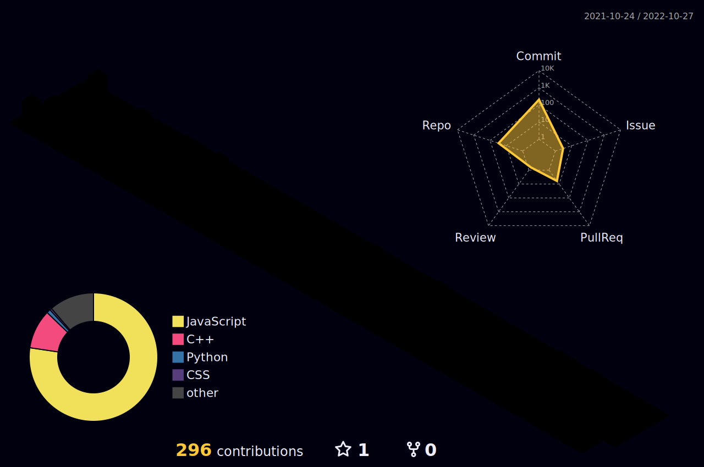

<div align="center" >
 
 
 
[](https://git.io/typing-svg)
 
 </div>

### :man_technologist: I'm Antar Das and I'm interested in programming and Solve Problems

Currently I'm learning, practicing courses and Data Structure and Algorithm.


<br>
<h2>Social Networks</h2>

[](https://facebook.com/Antardas0)
[](https://www.instagram.com/Antardas0/)
[](https://linkedin.com/in/Antardas)
[](https://github.com/Antardas)
[](mailto:antardas2334@gmail.com)


<br>
<br>


<br>
<br>
<h2>Skills</h2>


<p align="center">

  <a href="https://skillicons.dev">
    
  </a>
</p>
<p align="center">
  <a href="https://skillicons.dev">
    
  </a>
</p>
<p align="center">
  <a href="https://skillicons.dev">
    
  </a>
</p>


<details close="true">
  <summary><b>:gear: &nbsp;Git statistics</b></summary>



  <div align="center">
  
  
  
 </div>
 
 
 </details>

 <details close="true">
  <summary><b>:gear: &nbsp;Waka Time statistics</b></summary>
<!--START_SECTION:waka-->


**🐱 My GitHub Data** 

> 🏆 224 Contributions in the Year 2022
 > 
> 📦 196.9 kB Used in GitHub's Storage 
 > 
> 💼 Opted to Hire
 > 
> 📜 44 Public Repositories 
 > 
> 🔑 13 Private Repositories  
 > 
**I'm a Night 🦉** 

```text
🌞 Morning    26 commits     ██░░░░░░░░░░░░░░░░░░░░░░░   8.25% 
🌆 Daytime    92 commits     ███████░░░░░░░░░░░░░░░░░░   29.21% 
🌃 Evening    132 commits    ██████████░░░░░░░░░░░░░░░   41.9% 
🌙 Night      65 commits     █████░░░░░░░░░░░░░░░░░░░░   20.63%

```
📅 **I'm Most Productive on Wednesday** 

```text
Monday       35 commits     ██░░░░░░░░░░░░░░░░░░░░░░░   11.11% 
Tuesday      27 commits     ██░░░░░░░░░░░░░░░░░░░░░░░   8.57% 
Wednesday    80 commits     ██████░░░░░░░░░░░░░░░░░░░   25.4% 
Thursday     49 commits     ████░░░░░░░░░░░░░░░░░░░░░   15.56% 
Friday       51 commits     ████░░░░░░░░░░░░░░░░░░░░░   16.19% 
Saturday     46 commits     ███░░░░░░░░░░░░░░░░░░░░░░   14.6% 
Sunday       27 commits     ██░░░░░░░░░░░░░░░░░░░░░░░   8.57%

```


📊 **This Week I Spent My Time On** 

```text
⌚︎ Time Zone: Asia/Dhaka

💬 Programming Languages: 
JavaScript               21 hrs 45 mins      █████████████░░░░░░░░░░░░   53.22% 
Python                   11 hrs 44 mins      ███████░░░░░░░░░░░░░░░░░░   28.72% 
TypeScript               2 hrs 14 mins       █░░░░░░░░░░░░░░░░░░░░░░░░   5.47% 
C++                      1 hr 8 mins         ░░░░░░░░░░░░░░░░░░░░░░░░░   2.79% 
JSON                     46 mins             ░░░░░░░░░░░░░░░░░░░░░░░░░   1.91%

🔥 Editors: 
VS Code                  40 hrs 53 mins      █████████████████████████   100.0%

🐱‍💻 Projects: 
admin                    12 hrs 17 mins      ███████░░░░░░░░░░░░░░░░░░   30.08% 
Python                   11 hrs 13 mins      ██████░░░░░░░░░░░░░░░░░░░   27.45% 
newtrimed                8 hrs 34 mins       █████░░░░░░░░░░░░░░░░░░░░   20.99% 
Typescript               3 hrs 14 mins       ██░░░░░░░░░░░░░░░░░░░░░░░   7.92% 
frontend                 2 hrs 4 mins        █░░░░░░░░░░░░░░░░░░░░░░░░   5.08%

💻 Operating System: 
Windows                  40 hrs 53 mins      █████████████████████████   100.0%

```

**I Mostly Code in JavaScript** 

```text
JavaScript               32 repos            ████████████████░░░░░░░░░   66.67% 
HTML                     11 repos            █████░░░░░░░░░░░░░░░░░░░░   22.92% 
Python                   2 repos             █░░░░░░░░░░░░░░░░░░░░░░░░   4.17% 
CSS                      1 repo              ░░░░░░░░░░░░░░░░░░░░░░░░░   2.08% 
C++                      1 repo              ░░░░░░░░░░░░░░░░░░░░░░░░░   2.08%

```


**Timeline**

 


 Last Updated on 06/11/2022 18:46:38 UTC
<!--END_SECTION:waka-->

 
 
 </details>
